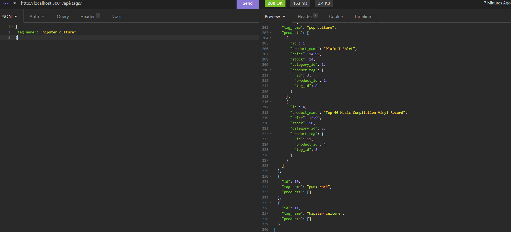

# Ecommerce Backend

## DESCRIPTION

> To test my ability to create a server and operate it dynamically.
> To gain a better understanding of making an API.
> A potential clients ability to have a store.
> New ways to utilize JavaScript, Node, and packages.

## INSTALLATION

>

## USAGE

For personal use

## LANGUAGES & TECHNOLOGIES

> JavaScript,ES6,Node and Sequelize, MYSQL2, Express.js

## AUTHOR(S)

>

- [Jacob Ambrose](https://www.github.com/jambrose0)
  >

## LICENSE

## PREVIEW

> 
